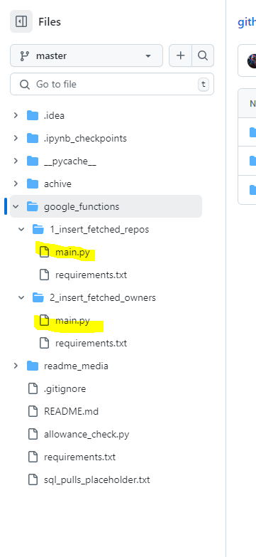
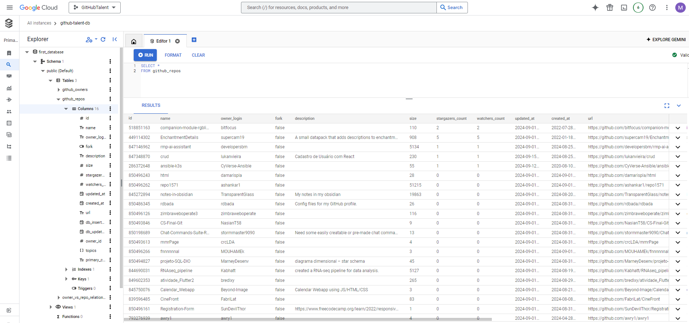
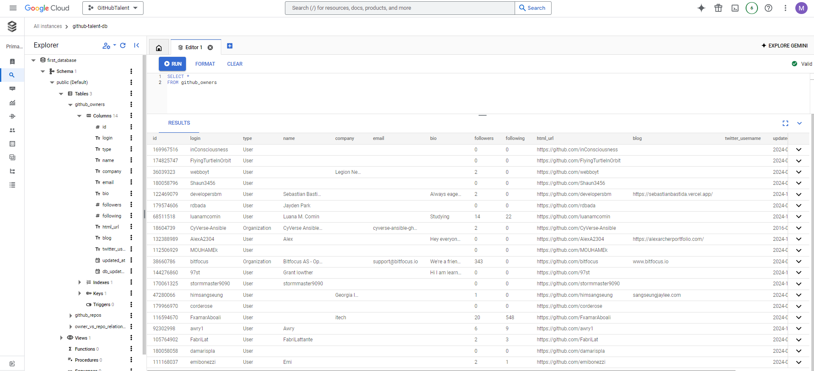
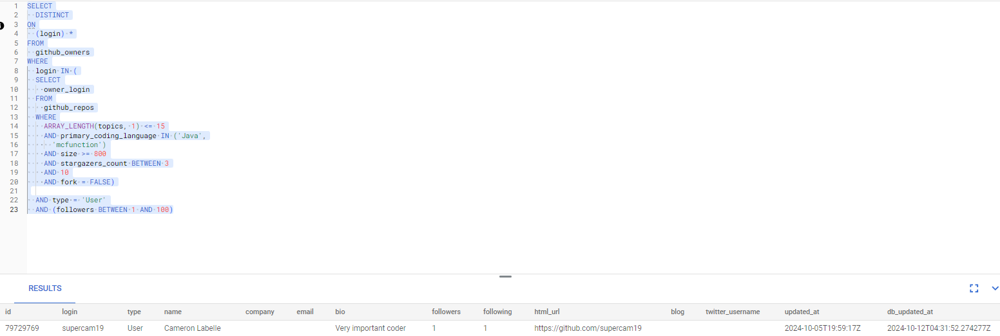

# I. Author's context:
- While doing 2 data analytics projects, I pulled data local machine on an ad hoc basis. Although the ETL projects successfully retrieved the data, they would lack attributes required in real world settings:
  - automation
  - reliability
  - scalability
  - integration ease
  - security needed for a continuous data streams

- This __data engineering__ project resolves the above concerns by building a different ETL and __upgrading to a 100% cloud-hosted solution__.

- This is my first experience with a major cloud platform e.g. AWS, Azure, GCP

- The resulting tool helps technical recruiters identify candidates with relevant GitHub repos.

# II. What I built/New tech used:
## 1. Fully cloud-based ETL pipeline (80%)
### Extraction
Separate processes each calls different GitHub APIs to ingest data about recently updated repos and their owners' profiles. Runs said scripts in __Google Cloud Run__ instead of a local machine i.e. no downtime from machine crashes, power outages, or internet disruptions.

Stores passwords and API keys in secure and scalable ways using __Google Cloud Secret Manager__ instead of ad hoc environment attributes.
 
 
### Storage
Runs an expandable Postgres database in __Google Cloud SQL__, which is no longer limited by my local machine's disk space.

Database credentials safely stored in __Google Cloud Secret Manager__.
 
 
### Transformation
SQL scripts read repo information out of database, transform the data with lead-scoring, and creates a list of repo owners/authors to approach.   
 
 
### Load/Data Visualization
In current rendition, loads grids for:
* which profiles a recruiter might chase 
* viable contact methods

At scale, will consider __BigQuery__ for larger datasets and __Looker Studio__ for more complex visualizations.
 
 

## 2. Automation (20%)
Uses __Google Cloud Scheduler__ to invoke aforementioned processes on a schedule and handle transient failures
 
 

# III. Methodology (illustrative example) for discovering talent:
Assume the customer is a technical recruiter on the hunt for __Minecraft game developers__.

1. have suitable repos:
   1. with 1 of 2 signals for topic relevance, either:
      1. topics tagged should include "minecraft", but most repos don't even have tags 
      2. Since most repos don't even use manual topic tags, we can look at primary language "mcfunction" as a surefire way to know the repo is focused on Minecraft
   2. repos are ignored if over 25 topics are tagged, to block repos that are gaming the system or have trouble prioritizing in their communication. Google uses this same threshold for their Careers web site
   3. The repo has at least 30 commits and a file size of at least 1 megabyte, to show some level of intensity
   4. Updated within the last 6 months, so we know the skills are fresh
   5. External validation in the form of +3 stars

2. tied to suitable profiles:
   1. profiles are from an individual, not an organization
   2. shows a method for contacting e.g.e-mail address, personal web site, LinkedIn pages, or Twitter handles
   3. priority given to profiles with 2 or more relevant repos 
   4. profiles deprioritized if too many followers or stars (too much competition)

# IV. Screenshots (illustrative, but not comprehensive):

__Wrote scripts to call APIs and extract information about GitHub recently updated repos (search window of 60 seconds) and their owners__  

 
 
 

__Google Run executes my scripts__ 

 
 
 
__These are the repos store in a PostGres database on Google Cloud SQL__ 

 
 
 
__A second script now extract repo OWNER data__ 

 
 
 
__Instead of storing credentials on my local machine's environment, I store database passwords and GitHub's authentication tokens in GCP Secret Manager.__ 

 
 
 

__Google Cloud Scheduler handles helps extract new repos every hour, and ties them to proper GitHub profiles once per day at 5AM EST.__ 

 
 
 
__Loading search results from some just-for-fun configurations__ 

 
 
 

# V. Learnings:
- I had to go through 4 different project ideas/data sources before I could find one where I wasn't limited by the scope of data, the volume of hits permitted, and the financial cost
- I built static web sites in the 1990s when deployment was a lot simpler. Publishing a web site to the web was simplying drag-and-dropping files into an FTP server, so I had trouble envisioning how modern day DevOps was a full-time job. That changed as soon I opened up Google Cloud Platform and started reading the summaries.
- To a non-technical, I wish someone would have explained AWS/GCP to me as the "GoogleSuite of DevOps". That would have helped me contextualize this a lot faster.
- There are waaaaay more configurations than I could have possibly imagined, I would have been helpless without ChatGPT to guide me
- In GoogleSuite, users don't need to manually link modules together and set permissions. That's not the case in GCP.
- Serverless tools like Google Cloud Function have no "preview" button, forcing long wait times between source code iterations
- So many challenges getting the Google Cloud Function to read database from Google Cloud SQL:
  - adding role + permissions
  - adding firewall
  - swapping to postgres from mysql, and the port that goes with it
- Google Scheduler has no way of storing variables, which could be problematic for having the right start times on API searches. I solved this by storing search times in a 3rd table.
- COST CONSIDERATIONS: This was the first time I had to really consider money as a decision-making factor. There are 2 factors at play A) how many search results GitHub APIs can hit at once, limited to 1000 and B) the fact that Scheduler lets me do only 93 tasks a month before before they start charging me $0.10 for 31 tasks. In a utopian scenario, I would have searched every minute of every hour of every day going back to the start of 2024. It would have been about 60 repos a minute or 4000 repos (more than the 1000 limit) an hour. If we did a minute-wide search, that would be
  - 1 job/min * 60 minutes * 24 hours = 1440 jobs/day
  - 1440 jobs/day * 30 days/month = 43,200
  - (43,200 - 93 freebies ) / 31 tasks * $0.10 = $ 139.60 credits burned per month, which is unacceptable given my GCP credit allotment was only $300

# VI. Potential improvements:
>**Product/UI:** 
- The priority behind this project was to prove technical feasibility, not product quality or engineering extensibility i.e. get a simple ETL working in the cloud ASAP. Given enough time, I would have had a far more complex lead-scoring system
- Totally impractical today, but eventually I could integrate this with an interactive web site where users could select keywords, set their own groupings, and filters. For example, maybe a user wants to see any repo authors with the topic tag "Minecraft"
- We could add word clustering e.g. a recruiter searches for repos demonstrating "AI" and my tool catches repos with "Artificial Intelligence". Now we need to debate on whether such a generic term should also catch specifics "Machine Learning", "ML", and "computer vision"
- I don't regret doing this project because it did what it was supposed to do, which was to expose me to a major cloud platform. From a commercial and product-market-fit standpoint, this has questionable value. For a competitive company looking for the best engineers, their process bottleneck is WINNING over applicants, not discovery (based on market interviews with potential users). So this tool might only be useful for recruiters at lesser known operations, but it has no value for the most prestigious orgs.

>**Engineering:** 
- Functions can and should be refactored to be more segregated and modular. For example, it might make sense to split the first function up across multiple files where one dedicated file is for Secret Manager to retrieve the Personal Authentication token.
- It was tedious testing out my code inside of GCP because of the delays from re-deploying Cloud Run

>**Tools** 
- BigQuery
- Looker Studio (formerly known as GCP Data Studio and not to be confused with Looker BI, which is more enterprise)